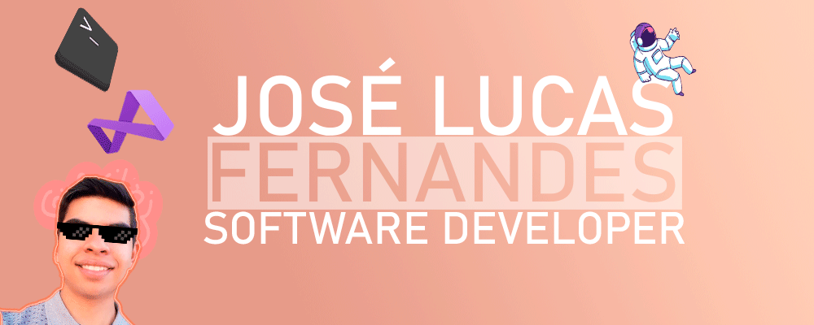

### 🙋🏻‍♂️ Seja bem vindo ao meu perfil 🎉

### Sobre mim

Meu nome é José Lucas e atualmente estou desenvolvendo varios projetos
nessa conta para tentar ao máximo contribuir com a comunidade.

* 🌱 Atualmente estou estudando C# e Rust.
* 📗 Estou cursando o ensino superior de Análise e Desenvolvimento de Sistemas.
* 💬 Pergunte me sobre qualquer coisa, ficarei feliz em ajudá-lo.
* 📫 E-Mail: jslucasfernandes@gmail.com.
* 🎮 Steam: /id/jslucas.
* 📞 Discord: zLucas#0001.

### Habilidades e ferramentas:

<code></code>
<code></code>
<code></code>
<code></code>
<code></code>
<code></code>
<code></code>
<code></code>
<code></code>
<code></code>
<code></code>
<code></code>
<code></code>
<code></code>
<code></code>
<code></code>

